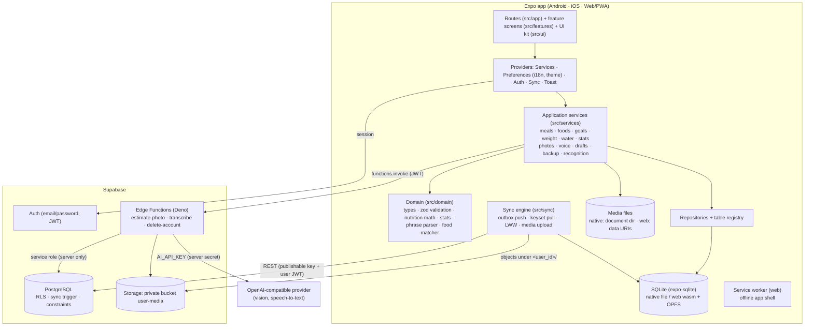
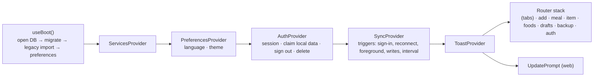

# Architecture

## Overview

## Principles

1. **Local first.** Every read and write goes to SQLite. The UI never waits for the network; sync runs in the background and is optional (no account, or no backend configured → local-only mode).
2. **Thin routes, layered features.** `src/app/*` only maps a URL to a feature screen. Screens call services through `useServices()`; services validate input (zod), run SQL through repositories inside transactions, enqueue sync work and emit change events. Domain code is pure and unit-tested.
3. **One write path.** Repositories' `insertEntity` / `updateEntity` / `softDeleteEntity` maintain `updated_at` (monotonic per record) and the outbox, so every feature gets synchronization and conflict handling for free.
4. **Reactive reads.** `useQuery(load, deps, topics)` reloads when a service emits a change for a topic (`dataEvents`), including changes pulled by sync. Loading, empty and error states are explicit in every screen.
5. **Predictable errors.** All failures become `AppError` with a stable code (`src/utils/errors.ts`); screens show localized messages (`errorText`). No silent `.catch(console.error)`.
6. **Server-side secrets only.** The client holds the Supabase URL and publishable key; authorization is RLS. Privileged work (AI calls, account deletion) happens in Edge Functions.
7. **Human in the loop for AI.** Recognition results are device-local drafts (`entry_drafts`) until the user confirms.

## Runtime composition

- Boot failures (database, migration) show a recoverable error screen; the legacy import failing does not block the app (retried next start).
- A root `ErrorBoundary` catches render errors and offers a retry; local data is unaffected.
- Owner model: `ownerStore` holds `local` or the signed-in user id. Data created while signed out is *claimed* (re-owned and queued) at sign-in; sign-out keeps unsynced changes; account deletion wipes local copies.

## Data flow examples

**Logging food offline:** `AddFoodScreen` → `MealService.addItemsToDay()` → transaction: resolve/create meal, insert items, outbox rows → `dataEvents.emit(['meals','meal_items'])` → dashboard re-queries. Later `SyncEngine.sync()` pushes the outbox in dependency order.

**Photo estimate:** capture → compress (≤1600 px, JPEG) → `PhotoService.add()` (file + pending row) → `estimatePhotoToDraft()` → `RecognitionGateway.estimatePhoto()` → Edge Function → sanitized items → `DraftService.create()` → review screen → `DraftService.confirm()` writes meal items with source `photo_ai`.

**Voice:** record (expo-audio) → `VoiceService.add()` → transcribe (Edge Function) or typed text → `parseFoodPhrases()` → `phrasesToDraftItems()` (match saved/recent foods, scale nutrition) → draft → confirm.

## Platform specifics

| Concern | Native | Web |
| --- | --- | --- |
| SQLite | expo-sqlite file database | expo-sqlite wasm + OPFS; requires COOP/COEP (cross-origin isolation) |
| Media files | `Paths.document/media/` | data URIs stored in SQLite |
| Export / import | share sheet / document picker | download / file input |
| Offline shell | the installed app | service worker (`public/sw.js`) |
| Layout | bottom tabs below 1000 px width, sidebar from 1000 px | same |

Platform files use the `.web.ts` suffix (`localFiles.web.ts`, `fileTransfer.web.ts`, `serviceWorker.web.ts`).

## Key modules

| Module | Responsibility |
| --- | --- |
| `src/database/serialDatabase.ts` | serializes statements/transactions over one connection (no interleaving) |
| `src/database/migrations.ts` | append-only SQLite migrations with `schema_migrations` |
| `src/database/schema.ts` | registry of synchronized tables/columns shared by repositories, sync, backup |
| `src/services/legacyMigration.ts` | idempotent import of the prototype's AsyncStorage data |
| `src/sync/syncEngine.ts` | push/pull/reconcile/purge; see [OFFLINE_SYNC.md](OFFLINE_SYNC.md) |
| `src/services/recognition.ts` | client boundary for AI functions and error mapping |
| `src/services/backupService.ts` | JSON backup/restore and CSV export; see [DATA_MODEL.md](DATA_MODEL.md) |
| `src/i18n/` | typed dictionaries, plural rules, Intl formatting |
| `scripts/build-pwa.mjs`, `scripts/web-headers.mjs` | PWA build step, hosting headers |

## Decisions

The decision log with rationale is kept in [EXECUTION_STATUS.md](EXECUTION_STATUS.md#important-architectural-decisions).
