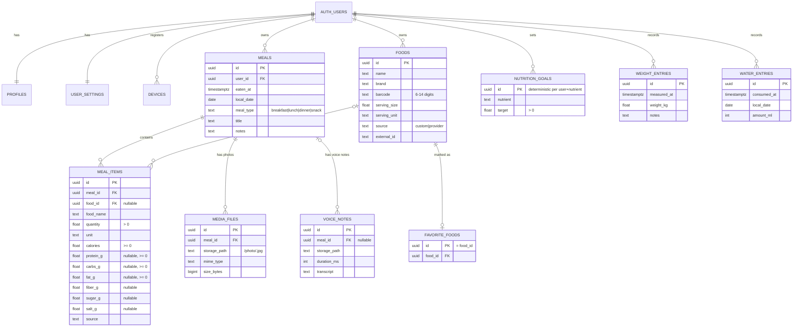

# Database

The app has two SQL databases with **the same column names** for every synchronized table:

| | Local | Server |
| --- | --- | --- |
| Engine | SQLite via `expo-sqlite` (native: file, web: wasm + OPFS) | PostgreSQL (Supabase) |
| Schema source | `src/database/migrations.ts` | `supabase/migrations/*.sql` |
| Purpose | primary store, offline-first | multi-device sync, backup |
| Timestamps | ISO-8601 UTC strings | `timestamptz` |
| Dates (`local_date`) | `YYYY-MM-DD` text | `date` |
| Ownership | `user_id` = Supabase user id, or `local` before sign-in | `user_id uuid` → `auth.users` |

`src/database/schema.ts` is the registry of synchronized tables and their columns. A test
(`tests-db/postgres.test.ts`) asserts that PostgreSQL has exactly the columns the registry declares,
and another (`tests/database/migrations.test.ts`) asserts the same for SQLite (plus local-only columns).

## Entity relationship diagram

Every synchronized table additionally has `user_id`, `created_at`, `updated_at`, `deleted_at`,
`server_updated_at`, `version` (see [OFFLINE_SYNC.md](OFFLINE_SYNC.md)).

## Tables

| Table | Synced | Notes |
| --- | --- | --- |
| `profiles` | account | 1:1 with `auth.users`, created by trigger `on_auth_user_created`. Only `display_name`. |
| `user_settings` | account | locale, theme, timezone. Created by the same trigger. |
| `devices` | account | one row per installation (`platform`, `app_version`, `last_seen_at`). |
| `foods` | yes | reusable food templates; nutrition per `serving_size serving_unit`; `barcode`, `source`, `external_id` prepared for provider/barcode lookup. |
| `favorite_foods` | yes | primary key equals `food_id`, so favoriting the same food on two offline devices converges. |
| `nutrition_goals` | yes | one row per (user, nutrient). Nutrients: calories, protein_g, carbs_g, fat_g, fiber_g, sugar_g, salt_g, water_ml. New nutrients only need a CHECK update. |
| `meals` | yes | meal type, time (`eaten_at`), `local_date` (calendar day in the user's timezone at entry time), title, notes. |
| `meal_items` | yes | food name, optional `food_id`, quantity + unit, calories (required) and optional macros. |
| `media_files` | yes | photo metadata only; the binary lives in Storage. |
| `voice_notes` | yes | audio metadata + optional transcript; binary in Storage. |
| `weight_entries` | yes | `measured_at`, `weight_kg`, notes. |
| `water_entries` | yes | `consumed_at`, `local_date`, `amount_ml`. |

Local-only tables (SQLite): `app_meta` (preferences, sync cursors, migration reports), `sync_outbox`,
`schema_migrations`. Local-only columns on media tables: `local_uri`, `upload_status`, `upload_attempts`,
`upload_error`.

## Constraints

* UUID primary keys generated on the client (`expo-crypto.randomUUID`) — inserts are idempotent upserts.
* Nutrition: `calories >= 0` (NOT NULL), every macro `IS NULL OR >= 0`; `quantity > 0`; upper bounds guard against typos.
* Enumerations as CHECK constraints (`meal_type`, `unit`, `source`, `nutrient`, `mime_type`).
* **Ownership integrity (PostgreSQL):** child tables reference their parent with a composite foreign key
  `(meal_id, user_id) → meals (id, user_id)` (same for `food_id`). A user therefore cannot attach rows to
  another user's meal even if they know its id — enforced by the database, not only by RLS.
* `media_files.storage_path` / `voice_notes.storage_path` must start with `<user_id>/` and must not contain `..`.
* `UNIQUE (user_id, nutrient)` for goals, `UNIQUE (user_id, food_id)` for favorites.
* Optional references use `ON DELETE SET NULL (column)` (PostgreSQL 15+) so purging a food never deletes meal history.
* SQLite mirrors the CHECK constraints and enforces `meal_items.meal_id → meals.id`, `media_files.meal_id`,
  `voice_notes.meal_id`, `favorite_foods.food_id` with `PRAGMA foreign_keys = ON`.

## Indexes

| Index | Query it serves |
| --- | --- |
| `meals (user_id, eaten_at)` | time-ordered meal lists |
| `meals (user_id, local_date)` (partial: not deleted on PG) | dashboard day view, history, statistics |
| `meal_items (meal_id)` | loading items of meals |
| `meal_items (user_id, created_at)` | recent foods |
| `meal_items (food_id)` partial | food usage |
| `weight_entries (user_id, measured_at)` | weight history/trend |
| `water_entries (user_id, local_date)` | daily water totals |
| `media_files (user_id, meal_id)`, `voice_notes (user_id, meal_id)` | meal attachments |
| `foods (user_id, lower(name))`, `foods (barcode)` partial | food search, barcode lookup |
| `<every synced table> (user_id, server_updated_at, id)` | incremental keyset pull |
| SQLite `sync_outbox (next_attempt_at)`, unique `(entity, entity_id)` | due push work, coalescing |

## Server-side behavior (triggers)

`tg_sync_row` runs before insert/update on every synchronized table:

1. clamps `updated_at` that is more than 5 minutes in the future (broken device clock);
2. on insert sets `version = 1`, `server_updated_at = clock_timestamp()`;
3. forbids changing `user_id`;
4. **last-write-wins:** an update whose `updated_at` is not newer than the stored one is skipped
   (stale writes and idempotent retries become no-ops);
5. otherwise increments `version`, refreshes `server_updated_at`, keeps `created_at`.

## Row Level Security

RLS is enabled **and forced** on every table in `public`. Synchronized tables: `select/insert/update` only
where `user_id = auth.uid()`; no DELETE policy (clients soft-delete). `anon` has no privileges at all.
Profiles/settings: owner may read and update only whitelisted columns. Storage: see [SECURITY.md](SECURITY.md).

## Migration strategy

### PostgreSQL

* Versioned files in `supabase/migrations/` named `YYYYMMDDHHMMSS_description.sql`, applied in order by
  the Supabase CLI (`supabase db push` / `supabase migration up`). Never edit an applied migration.
* Schema changes go through migrations only — never through the dashboard on production.
* Tests: `npm run test:db` creates a throwaway database, applies `supabase/tests/supabase_shim.sql`
  (emulates Supabase's `auth`/`storage` schemas and roles) and every migration, then checks constraints,
  RLS, the sync trigger and storage policies. CI runs it against `postgres:16`.

### SQLite

* `MIGRATIONS` in `src/database/migrations.ts` is append-only. Each migration runs in one transaction
  together with its `schema_migrations` row; failure rolls back to the last good version and the app shows
  a recoverable error screen instead of starting with a half-migrated database.
* A database created by a newer app version is refused (no silent downgrade).
* Destructive changes (drop/rename column) must use the copy-table pattern inside the migration and be
  covered by a test that migrates a populated database.

### Legacy AsyncStorage import (prototype data)

The prototype stored `meals_YYYY-MM-DD` → JSON array of `{ id, title, calories, createdAt }`.
`src/services/legacyMigration.ts` runs at every start until it has completed once:

1. detect keys matching `^meals_\d{4}-\d{2}-\d{2}$` (invalid dates are reported, not imported);
2. read all values (`multiGet`);
3. validate each entry leniently with zod (string/number ids, numeric strings, missing titles);
4. transform: one `meals` row (type `snack`, title = legacy title) + one `meal_items` row
   (quantity 1 serving, calories rounded, `source = 'legacy'`), chronological order preserved;
5. insert in **one transaction** with `INSERT OR IGNORE` and **deterministic ids**
   (name-based UUID of `date:legacyId:occurrence`), so re-runs never duplicate;
6. verify that every prepared meal + item exists, otherwise roll back;
7. store a report under `app_meta['legacy.asyncstorage.v1']` (counts of imported / already present /
   invalid entries and invalid keys).

The original AsyncStorage keys are **not deleted**. Imported rows enter the sync outbox, so they are
uploaded after the user signs in. The legacy `app_lang` preference is carried over to the new settings.
