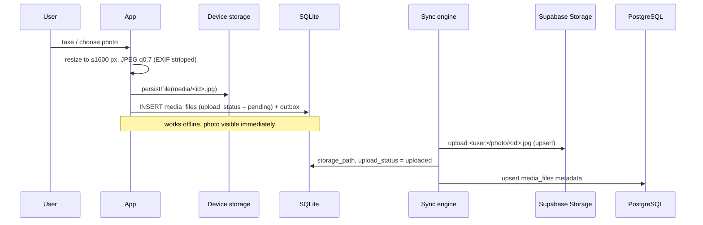
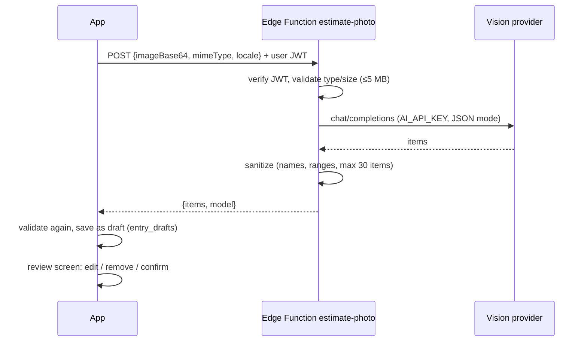
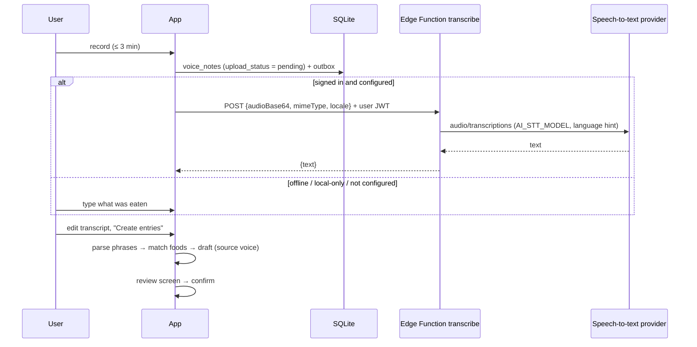

# Media: photos, voice notes and AI recognition

## Principles

- **Device first.** A photo or recording is stored on the device before anything else happens; the app works fully offline.
- **Private.** Binaries go to the private Supabase Storage bucket `user-media` under `<user_id>/photo/…` and `<user_id>/voice/…`. Storage RLS (`supabase/migrations/20261007000003_private_media_storage.sql`) only lets a user read and write their own folder. There are no public URLs.
- **Never automatic.** AI output (photo estimates, speech-to-text) only creates *drafts*. Nothing is logged until the user reviews and confirms the entries.
- **No secrets in the client.** Provider keys exist only as Edge Function secrets (`supabase/functions/.env.example`). The client holds the publishable key and the user session.

## Photos

| Step | Implementation |
| --- | --- |
| Capture / pick | `src/media/photoCapture.ts` (`expo-image-picker`; permissions requested on native, the browser asks on web; denial → `permission_denied` with a localized message) |
| Compression | `expo-image-manipulator`: longest edge ≤ 1600 px (`src/media/photoSize.ts`), JPEG quality 0.7. Re-encoding also removes EXIF metadata (including location) |
| Local storage | native: document directory `media/` (`src/media/localFiles.ts`); web: `data:` URI in the SQLite row (`localFiles.web.ts`) because browsers have no durable file system with stable URIs |
| Record | `PhotoService` (`src/services/photoService.ts`): max 10 photos per meal, max 8 MB after compression |
| Upload | `SyncEngine.uploadMedia`: the binary goes first and the metadata row is only pushed afterwards, so the server never references a missing object. Failures back off; after 10 failed attempts the photo stays `failed` until `retryFailedUploads()` |
| Other devices | Pulled rows have `storage_path` but no `local_uri`; `PhotoService.ensureLocal` downloads the object on first display (signed in only) and caches it |
| Replace | The new photo is stored before the old one is removed, so a failure never loses a photo |
| Delete | Soft delete (synchronized); the device copy is freed immediately; once the deletion has been pushed, the sync engine removes the storage object (best effort) |
| Meal deletion | Soft-deletes the meal's photos and voice notes as well |
| Account deletion | `delete-account` Edge Function removes every object under `<user_id>/`; the device copies are deleted by `wipeAccountData` |

UI: photo tab in *Add food* (`src/features/add/AddFoodScreen.tsx`), *Photos* card in the meal editor (`src/features/photos/PhotoViews.tsx`), photo counts on the dashboard meal cards. Upload status badges are shown only when sync is active.

## AI photo estimate

- Client boundary: `RecognitionGateway` (`src/services/recognition.ts`), implemented by `SupabaseRecognition`. It is available only when signed in to a configured backend. Error mapping: `401/403 → auth`, `503 not_configured → not_configured`, `400/413/422 → validation`, `429/5xx` and transport errors → `network`.
- Server: `supabase/functions/estimate-photo/index.ts`. It uses an OpenAI-compatible API (`AI_BASE_URL`, `AI_VISION_MODEL`). The image is processed in memory; it is neither stored nor logged.
- Drafts: `DraftService` (`src/services/draftService.ts`) stores them in the device-local `entry_drafts` table (SQLite schema v2; not synchronized). Recognizer output is untrusted: `sanitizeDraftItems` drops unusable items and turns out-of-range nutrition into "unknown".
- Review: `src/features/drafts/DraftScreens.tsx`. Unknown calories must be entered before confirmation. Meal type and date can be changed. Confirmed items get the source `photo_ai` (or `voice`). Pending drafts are announced on the dashboard.

## Voice notes

| Step | Implementation |
| --- | --- |
| Recording | `expo-audio` (`src/media/voiceRecording.ts`): mono AAC/M4A ~64 kbit/s on native, `audio/webm` (Opus) on web; microphone permission is requested first, denial gives `permission_denied`; recording stops automatically after 180 s |
| Record | `VoiceService` (`src/services/voiceService.ts`): max 10 notes per meal, 20 MB, audio MIME types only (codec parameters stripped); stored and synchronized like photos (`<user>/voice/<id>.<ext>`) |
| Playback | play / pause / position per note (`src/features/voice/VoiceViews.tsx`); notes pulled from another device are downloaded on first play |
| Delete | soft delete, device copy freed, storage object removed after the deletion is pushed |
| Speech-to-text | `supabase/functions/transcribe/index.ts`, called through `RecognitionGateway.transcribe`; language from the app locale, max 20 MB, 60 s timeout; the transcript (≤ 4000 chars) is saved on the note and synchronized |
| Phrase parsing | `src/domain/phraseParser.ts`: splits on commas/semicolons/new lines and "and/и/ja"; understands digits, decimal commas and number words in EN/RU/FI, units g/kg/ml/l/dl/slice/cup/tbsp/tsp/piece/serving/bowl |
| Food matching | `src/domain/foodMatcher.ts`: matches phrase names against saved foods and recently logged items (exact > prefix > stem); nutrition is scaled when the units agree, otherwise it stays unknown and must be entered in the review |

Without an account (or without `AI_API_KEY`) the text field is still available, so voice notes plus typed descriptions work fully offline.

## Configuration

| Secret (Edge Functions) | Purpose |
| --- | --- |
| `AI_API_KEY` | provider key; without it the AI functions answer `503 not_configured` and the app offers manual entry |
| `AI_BASE_URL` | default `https://api.openai.com/v1` |
| `AI_VISION_MODEL` | default `gpt-4o-mini` |
| `AI_STT_MODEL` | default `whisper-1` (voice notes) |
| `MEDIA_BUCKET` | default `user-media` |

## Tests

- `tests/services/photoService.test.ts`: storage, limits, replace safety, deletion, offline → sync → download on another device, account wipe.
- `tests/services/draftService.test.ts`: sanitizing, confirmation, meal fallback, claim at sign-in and wipe.
- `tests/services/voiceService.test.ts`: storage, limits, content type handling, deletion, upload + transcript sync + download on another device, text → draft flow, speech-to-text request.
- `tests/domain/phraseParser.test.ts`: EN/RU/FI phrases, units, number words, food matching and scaling.
- `tests/services/recognition.test.ts`: function error mapping, response normalization, base64.
- `tests/sync/syncEngine.test.ts`: binary-before-metadata, failure and backoff, storage object removal after a pushed deletion.
- Browser checks (web build) at 1280 px and 390 px:
  - Local-only: attach from library → open meal → add a second photo → remove → reload persistence → dashboard indicator.
  - Signed in against an intercepted Supabase API: estimate → review → confirm (the dashboard shows 540 kcal) → photo upload, then metadata push.
  - Voice (Chrome fake microphone): record → play → typed text (local) or fake `transcribe` (signed in) → draft "Eggs 2 / Coffee 1" → confirm → meal editor list → delete; signed in also verifies the `audio/webm` upload.
