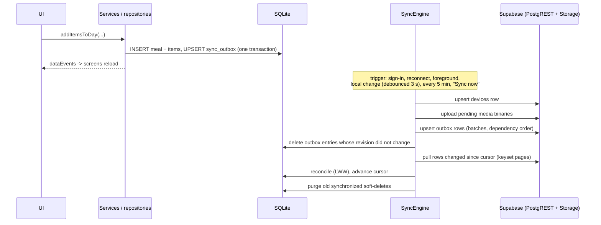

# Offline-first synchronization

The device database (SQLite) is the source of truth for the UI. Every screen
reads and writes local data only; the network is used opportunistically by the
sync engine (`src/sync/syncEngine.ts`). The app is fully usable without an
account, without a configured backend and without connectivity.

## Local bookkeeping

| Structure | Purpose |
| --- | --- |
| `sync_outbox(entity, entity_id UNIQUE, revision, attempts, last_error, next_attempt_at)` | One entry per locally changed record. Re-editing a queued record bumps `revision` instead of adding a second entry (coalescing). |
| `app_meta['sync.<user>.cursor.<entity>']` | Last pulled `(server_updated_at, id)` pair per table. |
| `app_meta['sync.<user>.orphans.<entity>']` | Pulled children whose parent is not present yet. |
| `app_meta['sync.<user>.last_success_at']` | Last sync without failures (shown in Settings). |
| `app_meta['device.id.<user>']` | Stable id of this installation for the `devices` table. |
| `server_updated_at`, `version` columns | Server metadata copied from the last pulled state. |

Writes and their outbox entries are committed in the **same SQLite
transaction** (`src/repositories/base.ts`), so a change can never be lost
between "saved" and "queued".

All bookkeeping keys are per account, so several people can use one device
without one account's cursor hiding data of another.

## Algorithm

1. **Guard.** Nothing runs when no user is signed in (owner `local`). Data
   created before sign-in is re-owned and queued by `claimLocalData` at
   sign-in.
2. **Single flight.** `sync()` shares a running sync; a call during a run
   schedules exactly one follow-up run so edits made meanwhile are not left
   waiting.
3. **Device registration** (best effort).
4. **Media upload first.** Photos/voice notes with `upload_status` `pending`
   or `failed` (below the attempt limit) are uploaded to
   `<user_id>/photo|voice/<id>.<ext>` with overwrite enabled (idempotent).
   Only after the object exists is the row marked `uploaded` and queued, so the
   server never references a missing object. A rejected upload marks the row
   `failed`, increments `upload_attempts` and keeps the local file.
5. **Push.** Per table in dependency order (`foods`, `favorite_foods`,
   `nutrition_goals`, `meals`, `meal_items`, `media_files`, `voice_notes`,
   `weight_entries`, `water_entries`), due outbox entries are read in batches of
   100 and sent as one `upsert ... on conflict (id)`. After success, entries are
   deleted **only if their revision is unchanged** — a record edited while the
   request was in flight stays queued.
   - Server-managed columns (`server_updated_at`, `version`) and device-only
     columns (`local_uri`, `upload_*`) are never sent.
   - If the server rejects a batch, records are retried one by one to isolate
     the offending row; it gets `attempts + 1`, `last_error` and an
     exponential `next_attempt_at` (30 s, 1 min, 2 min, … capped at 6 h). Other
     rows continue.
   - A transport error aborts the run (`status: offline`); everything stays
     queued.
6. **Pull.** Per table, pages of 500 rows ordered by `(server_updated_at, id)`
   are requested with keyset pagination
   (`server_updated_at > ts OR (server_updated_at = ts AND id > id)`). This is
   correct even when thousands of rows share one timestamp. Each run starts
   2 minutes before the saved cursor (inclusive) to tolerate transactions that
   committed late with an earlier timestamp; re-read rows whose `version` and
   `server_updated_at` match the local copy are skipped. The cursor is stored
   as the raw server string (microsecond precision).
7. **Reconcile** each pulled row (validated with zod, `src/sync/remoteSchemas.ts`;
   invalid rows and rows of other users are ignored and reported):
   - unknown locally → insert;
   - local copy without pending change → overwrite with server state;
   - local copy with a pending change → **last write wins** on `updated_at`:
     if the local edit is newer or equal it is kept (and pushed next run),
     otherwise the server state replaces it and the outbox entry is dropped.
   - A child whose parent is missing locally (foreign key failure) is parked
     in `sync.<user>.orphans.<entity>` and retried at the start of the next pull.
8. **Purge.** Soft-deleted rows older than 30 days with no outbox entry are
   physically removed (children before parents); local media files of purged
   rows are deleted.
9. `sync.<user>.last_success_at` is updated when the run had no failures; screens are
   notified via `dataEvents`.

## Server side guarantees

`tg_sync_row` (see [DATABASE.md](DATABASE.md)) makes pushes idempotent and
ordered:

- `server_updated_at = clock_timestamp()` and `version + 1` on every applied
  write; clients cannot set them.
- An update whose `updated_at` is not newer than the stored one is ignored
  (retries and stale devices are no-ops). Client clocks more than 5 minutes in
  the future are clamped.
- `user_id` can never change; RLS restricts every statement to
  `auth.uid()`; composite foreign keys prevent attaching children to another
  user's meal.
- Rows are never hard-deleted by clients (no `DELETE` policy); deletion is
  `deleted_at` (soft delete), which propagates like any other edit.

## Conflict policy

Record-level **last-write-wins on `updated_at`** (the client edit time,
monotonic per device via `nextTimestamp`). Rationale: entries are personal,
usually edited on one device at a time, and fields of a record are
semantically coupled (e.g. quantity and calories). Consequences:

- Concurrent edits of the *same* record on two offline devices: the later
  edit wins entirely; the other is discarded without a prompt.
- Delete vs. edit: whichever happened later wins (a later edit "undeletes" by
  writing `deleted_at = null`).
- Adding items to the same meal on two devices: both survive (different
  records).
- Clock skew: a device with a fast clock wins more often; the server clamps
  values far in the future.

## Triggers (`src/sync/SyncProvider.tsx`)

- sign-in / session restore,
- network reconnect (`expo-network` listener, offline → online),
- app returning to foreground,
- local changes (debounced 3 s, only if the outbox is non-empty),
- every 5 minutes while in the foreground,
- "Sync now" in Settings.

Status exposed to the UI: `disabled` (no backend configured), `signedOut`,
`idle`, `syncing`, `offline`, `error`, plus pending count and last successful
sync time.

## Media from other devices

Pulled media rows arrive with `upload_status = 'uploaded'` and no
`local_uri`. Binaries are downloaded on demand via the gateway's
`downloadFile` (authenticated; the bucket is private) and cached locally.

## Tests

`tests/sync/syncEngine.test.ts` runs the real engine against two SQLite
databases and an in-memory server (`tests/helpers/fakeRemote.ts`) that
implements the server trigger semantics, RLS and foreign keys. Covered:
offline queueing and retry, lost responses (no duplicates), edits during
push, poison-row isolation and backoff, two-device sync with soft delete,
concurrent LWW, pagination with identical timestamps, overlap re-reads,
invalid and foreign rows, orphans, single flight, ownership, purge retention
and media upload ordering. `tests-db/postgres.test.ts` verifies the real
PostgreSQL trigger and RLS behaviour.
